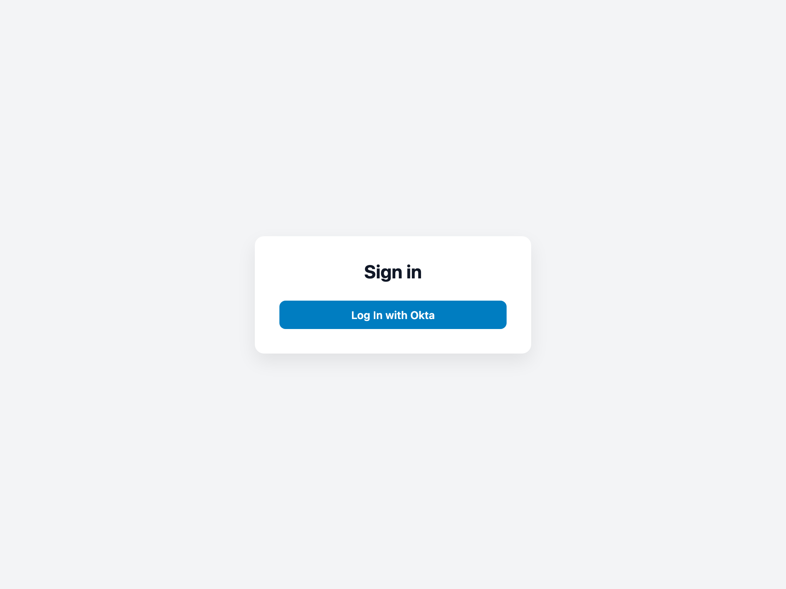

# Laravel Okta

[](https://packagist.org/packages/bbs-lab/laravel-okta)
[](https://github.com/BBS-Lab/laravel-okta/actions/workflows/run-tests.yml)
[](https://packagist.org/packages/bbs-lab/laravel-okta)

Framework-agnostic Okta SSO for Laravel. It registers the [socialiteproviders/okta](https://socialiteproviders.com/Okta/) driver, wires the login / callback / logout flow, exposes login-lifecycle hooks, and drives everything through a small **panel seam** so the same Okta capability can back any admin panel.

Most apps install an **adapter** rather than this package directly:

- [bbs-lab/nova-okta](https://github.com/BBS-Lab/nova-okta) — Laravel Nova
- [bbs-lab/filament-okta](https://github.com/BBS-Lab/filament-okta) — Filament

Install this package directly only when you are wiring Okta into a custom panel (see [Building an adapter](#building-an-adapter)).



## Requirements

- PHP 8.2+
- Laravel 11, 12 or 13

## Installation

```bash
composer require bbs-lab/laravel-okta
```

The service provider is auto-discovered.

### Okta application

In your Okta admin, create an **OIDC / Web** application and set:

- **Sign-in redirect URI**: `{APP_URL}/{prefix}/okta/callback`
- **Sign-out redirect URI**: `{APP_URL}/{prefix}/okta/callback/logout`

where `{prefix}` is the panel's route prefix (empty for the base package's default plain-application panel; the panel path for an adapter).

### Credentials

Add the `okta` block to `config/services.php` (this package intentionally does not own your credentials):

```php
'okta' => [
    'client_id' => env('OKTA_CLIENT_ID'),
    'client_secret' => env('OKTA_CLIENT_SECRET'),
    'redirect' => env('OKTA_REDIRECT_URI'), // optional — derived from the okta/callback route
    'base_url' => env('OKTA_BASE_URL'),
    // 'auth_server_id' => env('OKTA_AUTH_SERVER_ID'), // optional custom authorization server
],
```

```dotenv
OKTA_CLIENT_ID=
OKTA_CLIENT_SECRET=
OKTA_BASE_URL=https://your-org.okta.com
```

`OKTA_BASE_URL` is the bare org URL (no `/oauth2`). Keep the `redirect` key present (it may be `null`).

**`OKTA_REDIRECT_URI` is optional.** The redirect URI is a route this package generates, so when
it is not set the package derives it from the panel's `okta/callback` route automatically — you only
declare the matching **Sign-in redirect URI** in your Okta application. Set `OKTA_REDIRECT_URI`
(and the config value) only to override the derived URL, e.g. when the public URL differs from
`APP_URL` behind a reverse proxy.

## Routes

An adapter (or the base package on its own) mounts four routes for its panel via `OktaRoutes::register()`:

| Route | Name | Purpose |
|-------|------|---------|
| `GET okta/login` | `{panel}.login` | Redirects to Okta (start login). |
| `GET okta/callback` | `{panel}.callback` | Login callback — resolves the user and logs them in (this is the Sign-in redirect URI target). |
| `GET okta/logout` | `{panel}.logout` | Logs out locally, and — when `sso_logout` is on — via Okta's OIDC end-session (start logout). |
| `GET okta/callback/logout` | `{panel}.callback.logout` | Okta's post-logout landing (sign-out redirect). |

`{panel}` is the panel's route-name prefix (`okta` for the default panel, `nova-okta` / `filament-okta` for the adapters).

## Configuration

Everything works out of the box. To tweak behaviour, publish the config:

```bash
php artisan vendor:publish --tag=okta-config
```

```php
return [
    // Logout also ends the Okta session (OIDC end-session / single sign-out).
    // false = clear only the local session, leave the Okta session alone.
    'sso_logout' => env('OKTA_SSO_LOGOUT', true),

    // Reject a login whose Okta email is not verified (OIDC email_verified claim).
    // Guards against the email-based account-takeover class. Disable only if your
    // Okta org never sends email_verified.
    'require_verified_email' => env('OKTA_REQUIRE_VERIFIED_EMAIL', true),

    // Optional: match on Okta's stable "sub" via a column, then verified email.
    'identifier' => [
        'column' => env('OKTA_IDENTIFIER_COLUMN'), // e.g. 'okta_id'; null = email only
        'update' => env('OKTA_IDENTIFIER_UPDATE', true),
    ],
];
```

There is deliberately no user-mapping config — resolution uses your auth guard's own user provider, and everything else is a hook (below).

### User resolution & lifecycle

By default the package maps an Okta account to a local user through **your auth guard's own
user provider** (the Eloquent provider), matched by a verified email — no model or field config,
and it **never creates a user**. Everything else is a hook you register on the `Okta` facade (e.g.
in a service provider's `boot()`), so you opt into exactly what you need:

```php
use BBSLab\LaravelOkta\Facades\Okta;

// Decide WHO may sign in — this is the primary gate. Every callback must return
// true; return false to deny. Runs on top of the default resolver, keeping the
// verified-email check and the stable-id matching below.
Okta::authorizeUserToLogin(fn ($user, $oktaUser) => $user->is_active);

// Side effects around login.
Okta::beforeLogin(fn ($user, $oktaUser) => /* ... */);
Okta::afterLogin(fn ($user, $oktaUser) => $user->forceFill(['logged_at' => now()])->save());

// Audit a refused login (user not resolved, or an authorize callback denied it).
Okta::onLoginDenied(fn ($user, $oktaUser) => Log::warning('Okta login denied', ['email' => $oktaUser->getEmail()]));
```

The flow is: resolve → `authorizeUserToLogin` → `beforeLogin` → log in → `afterLogin`
(or `onLoginDenied` when resolution/authorization fails).

> **⚠️ `Okta::resolveUserUsing()` fully replaces the lookup** — it short-circuits the default
> resolver, so the built-in **verified-email gate and stable-id matching no longer run**. Only use
> it when you need custom resolution, and check the claims yourself. In particular, **do not
> provision a user from an unverified email**:
>
> ```php
> Okta::resolveUserUsing(function ($oktaUser) {
>     if (($oktaUser->getRaw()['email_verified'] ?? false) !== true) {
>         return null; // never trust an unverified email
>     }
>
>     return User::query()->where('email', $oktaUser->getEmail())->first();
> });
> ```
>
> For the common "match on the stable Okta id" case, prefer the built-in `identifier` config below
> instead of a custom resolver.

#### Matching by a stable id (optional)

Okta issues a stable subject id (the OIDC `sub`, `$oktaUser->getId()`). If you store it on your
users table, set the column in config and the default resolver matches on it **first** — so a
login survives the user's email changing — then falls back to a verified email, and **backfills**
the column the first time it matches by email:

```php
'identifier' => [
    'column' => 'okta_id', // or 'provider_id', etc.; null = match by email only
    'update' => true,      // backfill the column on the first (verified) email match
],
```

Add the column with a migration (make it **unique** — the id match trusts a single row). A
ready-made `okta_id` migration ships with the package:

```bash
php artisan vendor:publish --tag=okta-migrations
```

(adjust it if your column is named differently). An account matched by this id signs in without
re-checking the email (the link is already trusted), so `require_verified_email` only gates the
email-fallback path — and a link is only ever backfilled from a **verified** email.

> **The default resolver does not gate — it signs in any user it finds by email.** Deciding
> *who* may sign in is the app's job (a hook above, or a custom resolver below). Set an
> authorization rule for any admin panel.

#### Gating with a reusable resolver (extend, don't rewrite)

When several projects share the same sign-in policy, prefer a small resolver that **extends**
`DefaultOktaUserResolver` and adds the gate on top — you keep the verified-email check, the stable-id
matching and the backfill, and only add your policy. Bind it in a service provider:

```php
use BBSLab\LaravelOkta\Contracts\OktaUserResolver;

$this->app->bind(OktaUserResolver::class, GatedOktaUserResolver::class);
```

```php
use BBSLab\LaravelOkta\Resolvers\DefaultOktaUserResolver;
use Illuminate\Contracts\Auth\Authenticatable;
use Laravel\Socialite\Contracts\User as OktaUser;

class GatedOktaUserResolver extends DefaultOktaUserResolver
{
    /** The one thing that varies per project. */
    protected array $allowedRoles = ['root', 'admin'];

    public function resolve(OktaUser $oktaUser): ?Authenticatable
    {
        // Reuse the base lookup (verified email + stable-id matching + backfill)...
        $user = parent::resolve($oktaUser);

        // ...then apply the shared gate. Never create a user.
        if (! $user
            || ! $user->getAttribute('is_sso_allowed')
            || ! in_array($user->getAttribute('role'), $this->allowedRoles, true)) {
            return null;
        }

        return $user;
    }
}
```

> Prefer `Okta::authorizeUserToLogin()` for a per-project gate; reach for a resolver subclass only
> when the same policy is shared across projects. **Avoid a from-scratch resolver that re-implements
> an email-only lookup** — it silently drops the verified-email gate and the stable-id matching.

The `authorizeUserToLogin` / `beforeLogin` / `afterLogin` / `onLoginDenied` hooks run on top, so use
them for cross-cutting side effects (audit, a last-login stamp via `afterLogin`).

## Building an adapter

An adapter binds a single seam — the `BBSLab\LaravelOkta\Contracts\OktaPanel` contract — and then
registers the routes for it. **Everything panel-specific lives on the panel** (guard, URLs, routing,
the Socialite driver and the behaviour flags), never in a global the base reads directly — so several
panels can run side by side with different Okta configurations, each resolving its own panel per
request.

For a single-panel adapter whose settings come from `config('okta.*')`, extend `ConfigOktaPanel` and
supply only the routing + guard methods:

```php
use BBSLab\LaravelOkta\Support\ConfigOktaPanel;
use Illuminate\Http\Request;

class MyPanel extends ConfigOktaPanel
{
    public function guard(): ?string { return 'admin'; }          // null = auth.defaults.guard
    public function loginUrl(): string { return route('admin.login'); }
    public function homeUrl(Request $request): string { return url('/admin'); }
    public function routePrefix(): string { return 'admin'; }     // URI prefix, or '' for root
    public function routeName(): string { return 'my-okta'; }     // {name}.login, {name}.callback, …
    public function middleware(): array { return ['web']; }
}
```

For a multi-panel adapter, implement `OktaPanel` directly and return each panel's own values —
including `socialiteDriver()` (a distinct registered driver for a panel with its own Okta app),
`ssoLogout()`, `requireVerifiedEmail()`, `identifierColumn()` and `identifierUpdate()`.

Bind it and register the routes from wherever your panel's path and middleware are known:

```php
use BBSLab\LaravelOkta\Contracts\OktaPanel;
use BBSLab\LaravelOkta\Support\OktaRoutes;

$this->app->bind(OktaPanel::class, MyPanel::class);

OktaRoutes::register($this->app->make(OktaPanel::class));
```

Render an Okta button in your login screen that points at `route('my-okta.login')`, and point your
logout link at `route('my-okta.logout')`. That is the whole adapter surface.

When more than one panel is active, bind `OktaPanel` to a closure that returns the panel for the
**current** request (e.g. from the panel your framework is currently serving), and call
`OktaRoutes::register()` once per panel with a distinct `routeName()`.

### Session flags

On a successful Okta login the package sets two session keys:

- `okta_authenticated` — a signal meaning **"this session authenticated via Okta"** (not "MFA was performed"). A forced-2FA-enrolment guard can read it to skip enrolment for SSO users — but only do so if your **Okta application actually enforces MFA**, otherwise a single-factor Okta login would downgrade your 2FA.
- `okta_id_token` — the OIDC id_token, used to build the end-session (logout) URL.

## Testing

```bash
composer test          # Pest (unit + feature)
composer test-coverage # 100% line coverage on src/
composer analyse       # PHPStan level 8
composer format        # Pint
composer serve         # boot the workbench (a demo login page) at http://localhost:8000
```

### Browser & live e2e

The browser (Pest v4) and live Playwright suites cover the pre-redirect login UX (the Okta button
and the start of the OIDC redirect); the full SSO round-trip needs a real Okta org.

```bash
npm install && npx playwright install chromium   # once
composer test:browser                            # Pest v4 browser tests
npm run e2e                                       # live Playwright scenarios (auto-starts serve)
```

## Security

- **Verified emails.** The default resolver rejects unverified Okta emails (`require_verified_email`). If you replace the resolver, keep an equivalent check.
- **Logout is a `GET`** (so it can be a user-menu external link), which is why it relies on the framework's default `SESSION_SAME_SITE=lax` to prevent cross-site logout. Keep SameSite at `lax`/`strict`; if you set it to `none`, wire logout as a `POST` form instead.

Please email `paris@big-boss-studio.com` for security issues instead of the issue tracker.

## Changelog

See [CHANGELOG.md](CHANGELOG.md).

## Contributing

See [CONTRIBUTING.md](CONTRIBUTING.md).

## Credits

- [Big Boss Studio](https://github.com/BBS-Lab)

## License

The MIT License (MIT). See [LICENSE.md](LICENSE.md).
